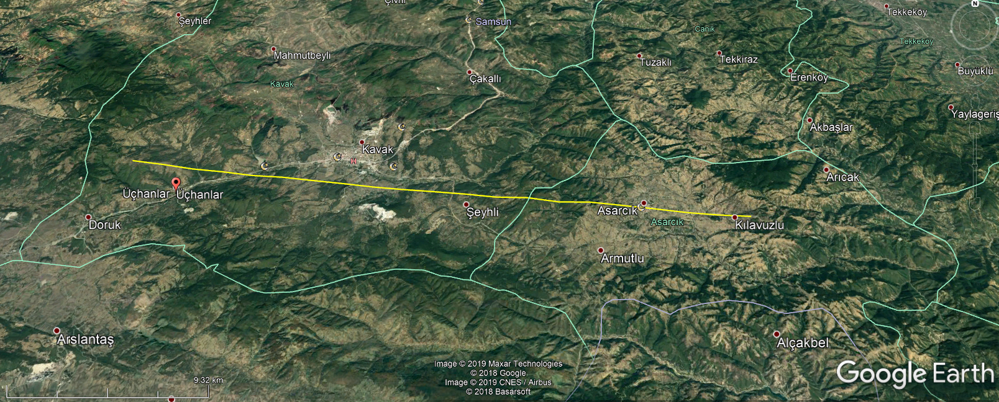
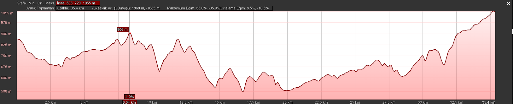

# Microwave Radiolink Design
This is a term project about microwave radiolink design from the course EHB 473 - Microwave - Radio Frequency Communication.

  

  

Snipped from beautiful [Google Earth Pro](https://www.google.com.tr/intl/tr/earth/versions/#download-pro) (Seriously just use it for 
exploring, 10/10 activity would recommend.)

The report can be found [here.](https://github.com/kantarcise/Microwave-Radiolink-Design/blob/master/Project.pdf)

It is written in Turkish, so i will do my very best to explain it throughly in this readme.

## Introduction

## Design

## Results and Future Work

## References

All the references are listed here, if you want to check them out.

[1] Prof. Dr. Mesut Kartal, “Lecture Notes” , İTÜ, 2019

[2] Book - Freeman, R. (2007). Radio system design for telecommunications. New York: IEEE.

[3] Ali, Mohammad & Jayakody, Dushantha Nalin & Chursin, Yury & Affes, Sofiène & Dmitry, Sonkin. (2019). Recent Advances and Future 
Directions on Underwater Wireless Communications. Archives of Computational Methods in Engineering. 26. 1-34. 10.1007/s11831-019-09354-
8.

[4] Google Earth Pro, link : https://www.google.com.tr/intl/tr/earth/

[5] Black Sea Forest Feautures, link : https://www.orman.gen.tr/karadeniz-ormanlari.html

[6] Waveguide Loss, link : https://www.microwaves101.com/encyclopedias/waveguide-loss

[7] Circulator, link : https://www.pasternack.com/images/ProductPDF/PE8403.pdf

[8] Eb / N0 plots, link : https://en.wikipedia.org/wiki/Eb/N0

